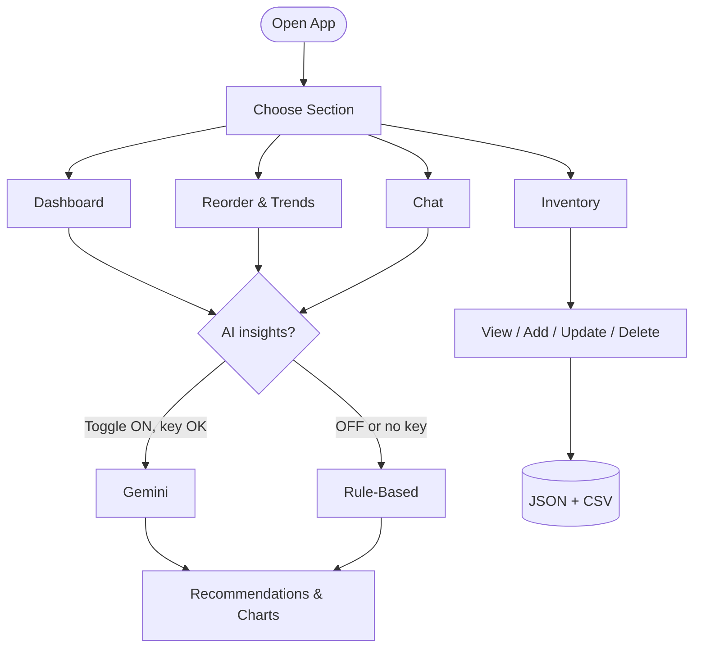

# Design Documentation

## Problem Framing

**Scenario:** Small cafes need lightweight, intelligent inventory support for perishables.  
**Primary challenge:** Avoid both stock-outs and over-ordering (waste) with minimal operational overhead.

This implementation targets:

- Fast inventory operations (add/search/update/delete)
- Trend visibility (item-wise and time-of-day consumption)
- Decision support (reorder recommendation, buy quantity, waste risk, promo intelligence)

---

## System Architecture

### Runtime

- **UI:** Streamlit single-page app with sectioned workflows
- **Data layer:** Local JSON + CSV for synthetic sample data
- **AI layer:** Gemini (`google-genai`) for natural-language insights
- **Fallback layer:** deterministic rule-based paths for every AI feature

### Data files

- `data/inventory_items.json`  
Inventory master data (`id`, `name`, `category`, `units`, `stock`, `reorder_level`, `shelf_life_days`, `unit_cost`, `notes`(optional))
- `data/consumption.csv`  
Timestamped usage (`date`, `time`, `item_id`, `quantity`, `day`)

---

## Simple Workflow

---

## Functional Modules

### Inventory module

- Create item (validated)
- View/search/filter
- Update stock & reorder thresholds
- Delete item with confirmation card

### Insights module

- Dashboard AI summary (priority bullets with highlighted key terms)
- Reorder recommendations (AI-first, fallback-safe)
- Reorder KPIs + suggested buy quantity + waste risk score
- Promo Intelligence (AI-first, fallback-safe)
- Consumption charts (recent share, time-slot, day-wise patterns)

### Conversational module

- Floating “Ask me anything” assistant
- Uses same inventory + usage context snapshots
- Controlled by global AI toggle

---

## AI Design & Fallback Strategy

### AI-enabled capabilities

- Dashboard Summary:`get_ai_dashboard_paragraph`
- Reorder Recommendation: `get_ai_dashboard_summary`
- Promotional Insights:`get_ai_promo_intelligence`
- Conversational Assistant:`get_ai_chat_response`
- Reorder Insights with Wastage Scores:`ai_forecast`

### Toggle behavior

- **AI ON + key available:** AI path used
- **AI OFF or key missing or API failure:** rule-based fallback used
- UI labels explicitly indicate method: `(AI)` vs `(Rule-Based)`

### Prompt constraints

- No invented numeric claims
- Use data-grounded language
- Paper cups treated as packaging/demand proxy for drinks, never as hero consumed product
- Short, actionable output (decision-oriented)

---

## Forecasting and Risk Logic

Rule-based forecast computes:

- Average daily consumption
- Days until reorder / runout
- Suggested buy quantity
- Waste risk score (0–100) with `green/amber/red` qualitative level

Waste risk depends on:

- Projected days of cover
- Shelf-life days
- Stock-vs-velocity balance

---

## UI/UX Strategy

- Centralized dashboard layout for readability
- Instant redirection to 'View and Search' after an item has been added/deleted for confirmation
- Consistent glowbox style for all AI sections
- Bullet-priority summaries with emphasized keywords
- Persistent AI chat at bottom right for easy access and quick answers
- Top-row AI toggle for immediate mode control

---

## Test Strategy

Implemented unit tests cover:

- Inventory CRUD validation and edge cases
- Forecast outputs (including new risk fields)
- AI toggle-off behavior forcing fallback
- Promo intelligence fallback behavior

Current suite ensures functional correctness without external API dependency.

---

## Security and Data Handling

- No secrets in code/repo
- API key sourced from `.env` only
- Synthetic data only, no customer PII

---

## Future Scope

Requested future scope items:

1. Add controlled dropdown enums for categories and units in Add Item
2. Migrate persistence to SQL and evolve to cloud-native architecture (managed DB, container deployment, env-based config, centralized logging)
3. Add **automatic** AI health monitor (scheduled API heartbeat + availability status in UI)
4. Expand testing future scope:
  - Integration tests for full add/update/delete-to-insight flows
  - Prompt regression tests for AI output contracts
  - Visual/chart snapshot tests
  - CI checks with minimum coverage gates

Additional strategic scope:

- Role-based access for multi-user cafe teams
- Multi-location support
- Supplier-side optimization and replenishment APIs
- Optional automated daily report (email/slack)

---

## Known Limitations

- Local file storage is not concurrency-safe for multi-user writes
- Forecasting is lightweight (not full probabilistic time-series)
- Promo suggestions are heuristic/LLM-guided, not campaign lift models
- No auth layer in current prototype

